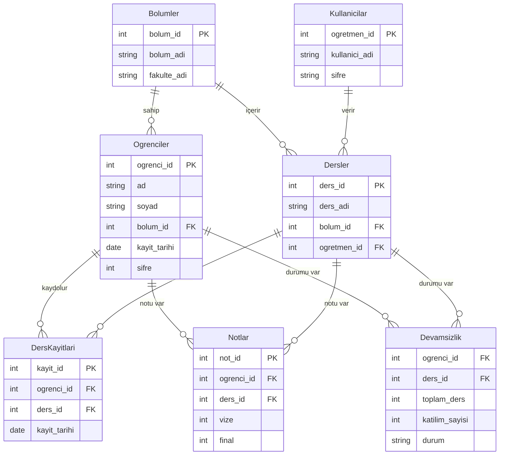

# Veri Modeli Şeması (Data Schema) 📊

Aşağıda Mini LMS sisteminin veritabanı yapısı ve tablolar arası ilişkiler Mermaid diagramı ile gösterilmiştir.

## Tablo Açıklamaları

*   **Bolumler**: Fakülte ve bölümlerin tanımlandığı temel tablo.
*   **Kullanicilar**: Sistemdeki öğretmenlerin ve yöneticilerin giriş bilgilerini tutar.
*   **Ogrenciler**: Öğrenci bilgilerini ve bölüm eşleşmelerini tutar.
*   **Dersler**: Bölüm bazlı açılan dersler ve bu dersleri veren öğretmenleri eşleştirir.
*   **DersKayitlari**: Öğrencilerin hangi dersleri aldığını takip eder (n-n ilişki çözümü).
*   **Notlar**: Öğrencilerin ders bazlı vize ve final sonuçlarını saklar.
*   **Devamsizlik**: Derse katılım oranlarını takip ederek otomatik kalma hesaplamasında kullanılır.

---
*Bu şema SQLAlchemy modelleri (`models.py`) ile tam uyumludur.*
